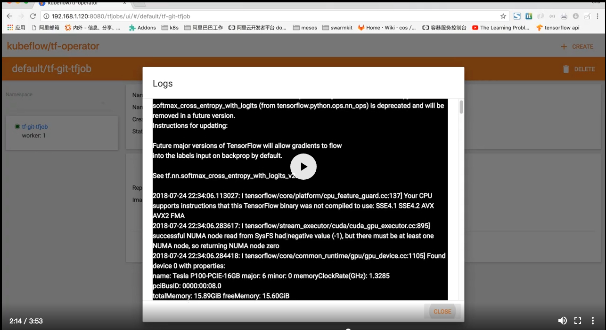

# Arena

[](https://travis-ci.org/AliyunContainerService/arena) 
[](https://goreportcard.com/report/github.com/AliyunContainerService/arena)


## Overview

Arena is a command-line interface for the data scientists to run and monitor the machine learning training jobs and check their results in an easy way. Currently it supports solo/distributed TensorFlow training. In the backend, it is based on Kubernetes, helm and Kubeflow. But the data scientists can have very little knowledge about kubernetes.

Meanwhile, the end users require GPU resource and node management. Arena also provides `top` command to check avaliable GPU resources in the Kubernetes cluster.

In one word, Arena's goal is to make the data scientists feel like to work on a single machine but with the Power of GPU clusters indeed.


## Setup

You can follow up the [Installation guide](docs/installation/README.md)

## User Guide

Arena is a command-line interface to run and monitor the machine learning training jobs and check their results in an easy way. Currently it supports solo/distributed training.

- [1. Run a training Job with source code from git](docs/userguide/1-tfjob-standalone.md)
- [2. Run a training Job with tensorboard](docs/userguide/2-tfjob-tensorboard.md)
- [3. Run a distributed training Job](docs/userguide/3-tfjob-distributed.md)
- [4. Run a distributed training Job with external data](docs/userguide/4-tfjob-distributed-data.md)

## Demo

[](http://cloud.video.taobao.com/play/u/2987821887/p/1/e/6/t/1/50210690772.mp4)


## Developing

Prerequisites:

- Go >= 1.8

```
mkdir -p $GOPATH/github.com/kubeflow
cd $GOPATH/github.com/kubeflow
git clone https://github.com/AliyunContainerService/arena.git
cd arena
make
```

Then you can get `arena` binary from `arena/bin`

## RoadMap

See [RoadMap](ROADMAP.md)
