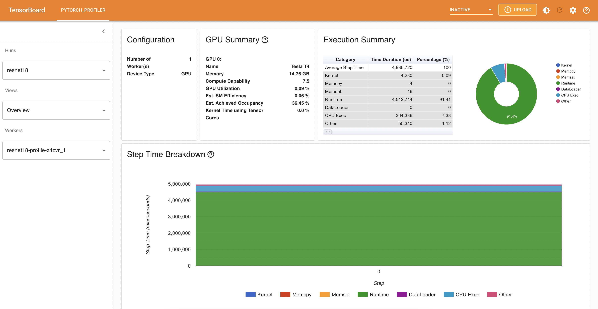

# Submit a model profile job

This guide walks through the steps required to profile a pytorch torchscript module.

1\. The first step is to check the available resources:

```shell
$ arena top node

NAME                       IPADDRESS      ROLE    STATUS  GPU(Total)  GPU(Allocated)
cn-shenzhen.192.168.1.209  192.168.1.209  <none>  Ready   1           0
cn-shenzhen.192.168.1.210  192.168.1.210  <none>  Ready   1           0
cn-shenzhen.192.168.1.211  192.168.1.211  <none>  Ready   1           0
---------------------------------------------------------------------------------------------------
Allocated/Total GPUs In Cluster:
0/3 (0.0%)
```

There are 3 available nodes with GPU for running model profile job.

2\. Prepare the model to profile and configuration.

In this example, we will profile a pytorch resnet18 model. We need save the resnet18 model as a torchscript module firstly.

```python
import torch
import torchvision

# An instance of your model.
model = torchvision.models.resnet18()

# An example input you would normally provide to your model's forward() method.
dummy_input = torch.rand(1, 3, 224, 224)

# Use torch.jit.trace to generate a torch.jit.ScriptModule via tracing.
traced_script_module = torch.jit.trace(model, dummy_input)

torch.jit.save(traced_script_module, "resnet18.pt")
```

Then give a profile configuration file named config.json like below.

```json
{
  "model_name": "resnet18",
  "model_platform": "torchscript",
  "model_path": "/data/models/resnet18/resnet18.pt",
  "inputs": [
    {
      "name": "input",
      "data_type": "float32",
      "shape": [1, 3, 224, 224]
    }
  ],
  "outputs": [
    {
      "name": "output",
      "data_type": "float32",
      "shape": [ 1000 ]
    }
  ]
}
```

3\. Submit a model profile job.

```shell
$ arena model profile \
    --name=resnet18-profile \
    --namespace=default \
    --image=registry.cn-beijing.aliyuncs.com/kube-ai/easy-inference:1.0.0 \
    --image-pull-policy=Always \
    --gpus=1 \
    --loglevel=debug \
    --data=model-pvc:/data \
    --model-config-file=/data/models/resnet18/config.json \
    --report-path=/data/models/resnet18/log \
    --tensorboard \
    --tensorboard-image=registry.cn-beijing.aliyuncs.com/kube-ai/easy-inference:1.0.0
    
service/resnet18-profile-tensorboard created
deployment.apps/resnet18-profile-tensorboard created
job.batch/resnet18-profile created
INFO[0001] The model profile job resnet18-profile has been submitted successfully
INFO[0001] You can run `arena model get resnet18-profile` to check the job status
```

4\. List all the profile jobs.

```shell
$ arena model list

NAMESPACE      NAME              STATUS   TYPE     DURATION  AGE  GPU(Requested)
default  resnet18-profile  RUNNING  Profile  34s       34s  1
```

5\. Get model profile job detail info.

```shell
$ arena model get resnet18-profile
Name:       resnet18-profile
Namespace:  default
Type:       Profile
Status:     RUNNING
Duration:   57s
Age:        57s
Parameters:
  --model-config-file  /data/models/resnet18/config.json
  --report-path        /data/models/resnet18/log


Instances:
  NAME                    STATUS             AGE  READY  RESTARTS  NODE
  ----                    ------             ---  -----  --------  ----
  resnet18-profile-z4zvr  ContainerCreating  57s  0/1    0         cn-shenzhen.192.168.1.210
```

6\. Use tensorboard view the profile result.

```shell
$ kubectl get svc
resnet18-profile-tensorboard     NodePort    172.16.37.74   <none>        6006:32744/TCP   14m

$ kubectl port-forward svc/resnet18-profile-tensorboard 6006:6006
Forwarding from 127.0.0.1:6006 -> 6006
Forwarding from [::1]:6006 -> 6006
```


