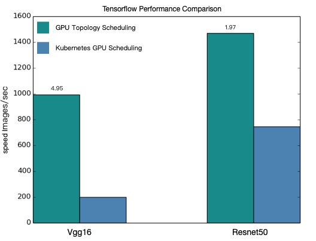

# Submit a MPI job with gpu topology scheduling

Arena supports gpu topology scheduling For distributed Training. We can enable gpu topology scheduling by adding parameter ``--gputopology``.
Learn more https://help.aliyun.com/document_detail/190482.html


## Vgg16
### Enable gpu topology scheduling
1. Submit a Tensorflow training job with gputopology
```bash
$ arena submit mpi \
  --name=tensorflow-topo-4-vgg16 \
  --gpus=1 \
  --workers=4 \
  --gputopology=true \
  --image=registry.cn-hangzhou.aliyuncs.com/kubernetes-image-hub/tensorflow-benchmark:tf2.3.0-py3.7-cuda10.1 \
  "mpirun --allow-run-as-root -np "4" -bind-to none -map-by slot -x NCCL_DEBUG=INFO -x NCCL_SOCKET_IFNAME=eth0 -x LD_LIBRARY_PATH -x PATH --mca pml ob1 --mca btl_tcp_if_include eth0 --mca oob_tcp_if_include eth0 --mca orte_keep_fqdn_hostnames t --mca btl ^openib python /tensorflow/benchmarks/scripts/tf_cnn_benchmarks/tf_cnn_benchmarks.py --model=vgg16 --batch_size=64 --variable_update=horovod"
```

2. Get the running status of the current job
```bash
$ arena get tensorflow-topo-4-vgg16 --type mpijob
Name:      tensorflow-topo-4-vgg16
Status:    RUNNING
Namespace: default
Priority:  N/A
Trainer:   MPIJOB
Duration:  2m

Instances:
  NAME                                    STATUS   AGE  IS_CHIEF  GPU(Requested)  NODE
  ----                                    ------   ---  --------  --------------  ----
  tensorflow-topo-4-vgg16-launcher-lmhjl  Running  2m   true      0               cn-shanghai.192.168.16.172
  tensorflow-topo-4-vgg16-worker-0        Running  2m   false     1               cn-shanghai.192.168.16.173
  tensorflow-topo-4-vgg16-worker-1        Running  2m   false     1               cn-shanghai.192.168.16.173
  tensorflow-topo-4-vgg16-worker-2        Running  2m   false     1               cn-shanghai.192.168.16.173
  tensorflow-topo-4-vgg16-worker-3        Running  2m   false     1               cn-shanghai.192.168.16.173
```

3. Get current log information
```bash
$ arena logs -f tensorflow-topo-4-vgg16
----------------------------------------------------------------
total images/sec: 991.92
----------------------------------------------------------------
```

### Disable gpu topology scheduling
1. Submit a Tensorflow training job with gputopology
```bash
$ arena submit mpi \
  --name=tensorflow-4-vgg16 \
  --gpus=1 \
  --workers=4 \
  --image=registry.cn-hangzhou.aliyuncs.com/kubernetes-image-hub/tensorflow-benchmark:tf2.3.0-py3.7-cuda10.1 \
  "mpirun --allow-run-as-root -np "4" -bind-to none -map-by slot -x NCCL_DEBUG=INFO -x NCCL_SOCKET_IFNAME=eth0 -x LD_LIBRARY_PATH -x PATH --mca pml ob1 --mca btl_tcp_if_include eth0 --mca oob_tcp_if_include eth0 --mca orte_keep_fqdn_hostnames t --mca btl ^openib python /tensorflow/benchmarks/scripts/tf_cnn_benchmarks/tf_cnn_benchmarks.py --model=vgg16 --batch_size=64 --variable_update=horovod"
```

2. Get the running status of the current job
```bash
$ arena get tensorflow-4-vgg16 --type mpijob
Name:      tensorflow-4-vgg16
Status:    RUNNING
Namespace: default
Priority:  N/A
Trainer:   MPIJOB
Duration:  9s

Instances:
  NAME                               STATUS   AGE  IS_CHIEF  GPU(Requested)  NODE
  ----                               ------   ---  --------  --------------  ----
  tensorflow-4-vgg16-launcher-xc28k  Running  9s   true      0               cn-shanghai.192.168.16.172
  tensorflow-4-vgg16-worker-0        Running  9s   false     1               cn-shanghai.192.168.16.172
  tensorflow-4-vgg16-worker-1        Running  9s   false     1               cn-shanghai.192.168.16.173
  tensorflow-4-vgg16-worker-2        Running  9s   false     1               cn-shanghai.192.168.16.172
  tensorflow-4-vgg16-worker-3        Running  9s   false     1               cn-shanghai.192.168.16.173
```

3. Get current log information
```bash
$ arena logs -f tensorflow-4-vgg16
----------------------------------------------------------------
total images/sec: 200.47
----------------------------------------------------------------
```

## resnet50
### Enable gpu topology scheduling
1. Submit a Tensorflow training job with gputopology
```bash
$ arena submit mpi \
  --name=tensorflow-topo-4-resnet50 \
  --gpus=1 \
  --workers=4 \
  --gputopology=true \
  --image=registry.cn-hangzhou.aliyuncs.com/kubernetes-image-hub/tensorflow-benchmark:tf2.3.0-py3.7-cuda10.1 \
  "mpirun --allow-run-as-root -np "4" -bind-to none -map-by slot -x NCCL_DEBUG=INFO -x NCCL_SOCKET_IFNAME=eth0 -x LD_LIBRARY_PATH -x PATH --mca pml ob1 --mca btl_tcp_if_include eth0 --mca oob_tcp_if_include eth0 --mca orte_keep_fqdn_hostnames t --mca btl ^openib python /tensorflow/benchmarks/scripts/tf_cnn_benchmarks/tf_cnn_benchmarks.py --model=resnet50 --batch_size=64  --variable_update=horovod"
```

2. Get the running status of the current job
```bash
$ arena get tensorflow-topo-4-resnet50 --type mpijob
Name:      tensorflow-topo-4-resnet50
Status:    RUNNING
Namespace: default
Priority:  N/A
Trainer:   MPIJOB
Duration:  8s

Instances:
  NAME                                       STATUS   AGE  IS_CHIEF  GPU(Requested)  NODE
  ----                                       ------   ---  --------  --------------  ----
  tensorflow-topo-4-resnet50-launcher-7ln8j  Running  8s   true      0               cn-shanghai.192.168.16.172
  tensorflow-topo-4-resnet50-worker-0        Running  8s   false     1               cn-shanghai.192.168.16.173
  tensorflow-topo-4-resnet50-worker-1        Running  8s   false     1               cn-shanghai.192.168.16.173
  tensorflow-topo-4-resnet50-worker-2        Running  8s   false     1               cn-shanghai.192.168.16.173
  tensorflow-topo-4-resnet50-worker-3        Running  8s   false     1               cn-shanghai.192.168.16.173
```

3. Get current log information
```bash
$ arena logs -f tensorflow-topo-4-resnet50
----------------------------------------------------------------
total images/sec: 1471.55
----------------------------------------------------------------
```

### Disable gpu topology scheduling
1. Submit a Tensorflow training job with gputopology
```bash
$ arena submit mpi \
  --name=tensorflow-4-resnet50 \
  --gpus=1 \
  --workers=4 \
  --image=registry.cn-hangzhou.aliyuncs.com/kubernetes-image-hub/tensorflow-benchmark:tf2.3.0-py3.7-cuda10.1 \
  "mpirun --allow-run-as-root -np "4" -bind-to none -map-by slot -x NCCL_DEBUG=INFO -x NCCL_SOCKET_IFNAME=eth0 -x LD_LIBRARY_PATH -x PATH --mca pml ob1 --mca btl_tcp_if_include eth0 --mca oob_tcp_if_include eth0 --mca orte_keep_fqdn_hostnames t --mca btl ^openib python /tensorflow/benchmarks/scripts/tf_cnn_benchmarks/tf_cnn_benchmarks.py --model=resnet50 --batch_size=64  --variable_update=horovod"
```

2. Get the running status of the current job
```bash
$ arena get tensorflow-4-resnet50 --type mpijob
Name:      tensorflow-4-resnet50
Status:    RUNNING
Namespace: default
Priority:  N/A
Trainer:   MPIJOB
Duration:  9s

Instances:
  NAME                                  STATUS   AGE  IS_CHIEF  GPU(Requested)  NODE
  ----                                  ------   ---  --------  --------------  ----
  tensorflow-4-resnet50-launcher-q24hv  Running  9s   true      0               cn-shanghai.192.168.16.172
  tensorflow-4-resnet50-worker-0        Running  9s   false     1               cn-shanghai.192.168.16.172
  tensorflow-4-resnet50-worker-1        Running  9s   false     1               cn-shanghai.192.168.16.173
  tensorflow-4-resnet50-worker-2        Running  9s   false     1               cn-shanghai.192.168.16.172
  tensorflow-4-resnet50-worker-3        Running  9s   false     1               cn-shanghai.192.168.16.173
```

3. Get current log information
```bash
$ arena logs -f tensorflow-4-resnet50
----------------------------------------------------------------
total images/sec: 745.38
----------------------------------------------------------------
```

## Performance Comparison


Based on the comparison results of the above four test cases, as shown in the figure above, the performance comparison results show that after GPU topology scheduling, tensorflow distributed training has a good improvement effect.
Note: the result of GPU topology aware scheduling promotion has a certain relationship with the model used by users and the cluster environment. Users can refer to the above examples to evaluate their own model.