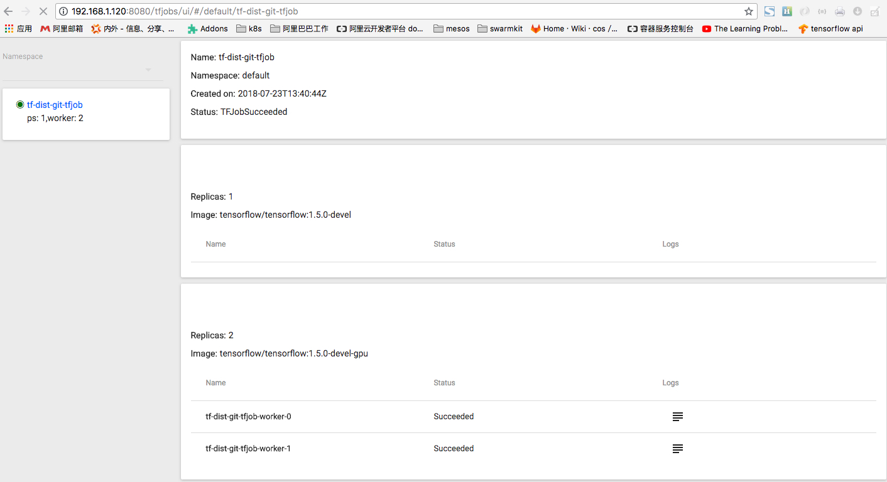



Arena 为分布式 TensorFlow 训练（ps/worker 模式）提供了支持和简化。 


1.要运行分布式 Tensorflow 训练，您需要指定以下信息：

 - 各 Worker 的 GPU（仅 GPU 工作负载需要）
 - Worker 的数量（必需）
 - PS 的数量（必需）
 - Worker 的 docker 映像（必需）
 - PS 的 docker 映像（必需）
 - Worker 的端口（默认为 22222）
 - PS 的端口（默认为 22223）

如下命令提供了一个示例。本例中定义了 2 个 Worker 和 1 个 PS，每个 Worker 有 1 个 GPU。Worker 和 PS 的源代码位于 git 中，Tensorboard 已启用。

```
#arena submit tf --name=tf-dist-git              \
              --gpus=1 \
              --workers=2 \
              --workerImage=tensorflow/tensorflow:1.5.0-devel-gpu \
              --syncMode=git \
              --syncSource=https://github.com/cheyang/tensorflow-sample-code.git \
              --ps=1 \
              --psImage=tensorflow/tensorflow:1.5.0-devel \
              --tensorboard \
              "python code/tensorflow-sample-code/tfjob/docker/v1alpha2/distributed-mnist/main.py --logdir /training_logs"
NAME:   tf-dist-git
LAST DEPLOYED: Mon Jul 23 21:32:20 2018
NAMESPACE: default
STATUS: DEPLOYED

RESOURCES:
==> v1beta1/Deployment
NAME DESIRED CURRENT UP-TO-DATE AVAILABLE AGE
tf-dist-git-tfjob 1 0 0 0 0s

==> v1alpha2/TFJob
NAME AGE
tf-dist-git-tfjob 0s

==> v1/Pod(related)
NAME READY STATUS RESTARTS AGE
tf-dist-git-tfjob-59f7c7d5df-q8bfz 0/1 Pending 0 0s

==> v1/Service
NAME TYPE CLUSTER-IP EXTERNAL-IP PORT(S) AGE
tf-dist-git-tfjob NodePort 172.19.5.150  6006:32582/TCP 0s
```

2\.获取特定作业的详细信息

```
#arena get tf-dist-git
NAME STATUS TRAINER AGE INSTANCE NODE                   
tf-dist-git RUNNING tfjob 55s tf-dist-git-tfjob-594d59789c-lrfsk 192.168.1.119
tf-dist-git RUNNING tfjob 55s tf-dist-git-tfjob-ps-0 192.168.1.118
tf-dist-git RUNNING tfjob 55s tf-dist-git-tfjob-worker-0 192.168.1.119
tf-dist-git RUNNING tfjob 55s tf-dist-git-tfjob-worker-1 192.168.1.120

Your tensorboard will be available on:
192.168.1.117:32298
```

3\.检查 Tensorboard


4\.获取 TFJob 控制台

```
#arena logviewer tf-dist-git
Your LogViewer will be available on:
192.168.1.120:8080/tfjobs/ui/#/default/tf-dist-git-tfjob
```




恭喜！您已经成功使用 `arena` 运行了分布式训练作业。 
