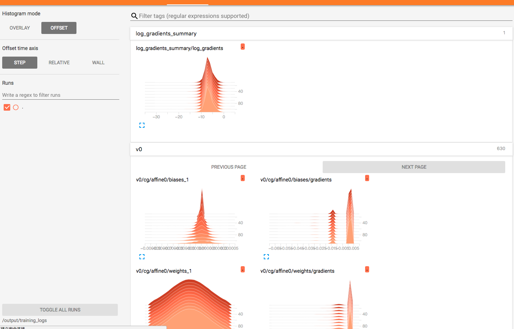


Arena 为分布式 TensorFlow 训练（MPI 模式）提供了支持和简化。 


1.要借助 MPI 支持运行分布式训练，您需要指定以下信息：

 - 各 Worker 的 GPU（仅 GPU 工作负载需要）
 - Worker 的数量（必需）
 - mpi Worker 的 docker 映像（必需）
 

如下命令提供了一个示例。本例中定义了 2 个 Worker 和 1 个 PS，每个 Worker 有 1 个 GPU。Worker 和 PS 的源代码位于 git 中，Tensorboard 已启用。

```
#arena submit mpi --name=mpi-dist              \
              --gpus=1 \
              --workers=2 \
              --image=uber/horovod:0.13.11-tf1.10.0-torch0.4.0-py3.5 \
              --env=GIT_SYNC_BRANCH=cnn_tf_v1.9_compatible \
              --syncMode=git \
              --syncSource=https://github.com/tensorflow/benchmarks.git \
              --tensorboard \
              "mpirun python code/benchmarks/scripts/tf_cnn_benchmarks/tf_cnn_benchmarks.py --model resnet101 --batch_size 64 --variable_update horovod --train_dir=/training_logs --summary_verbosity=3 
              --save_summaries_steps=10"
```

2\.获取特定作业的详细信息

```
#arena get mpi-dist
NAME STATUS TRAINER AGE INSTANCE NODE
mpi-dist RUNNING MPIJOB 1d mpi-dist-mpijob-launcher-ndnw8 192.168.1.120
mpi-dist RUNNING MPIJOB 1d mpi-dist-mpijob-worker-0 192.168.1.119
mpi-dist RUNNING MPIJOB 1d mpi-dist-mpijob-worker-1 192.168.1.120

Your tensorboard will be available on:
192.168.1.117:32559
```

3\.检查 Tensorboard




4\.获取 MPI 控制台

```
#arena logviewer mpi-dist
Your LogViewer will be available on:
192.168.1.119:9090/#!/log/default/mpi-dist-mpijob-launcher-ndnw8/mpi?namespace=default
```


恭喜！您已经成功使用 `arena` 运行了分布式 MPI 训练作业。 
